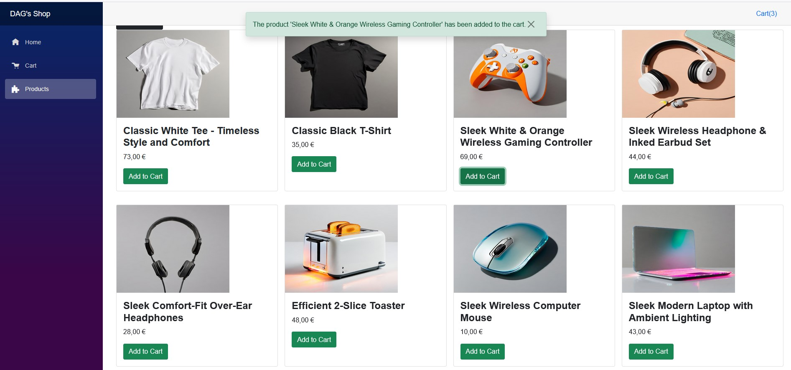
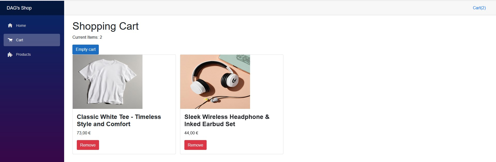
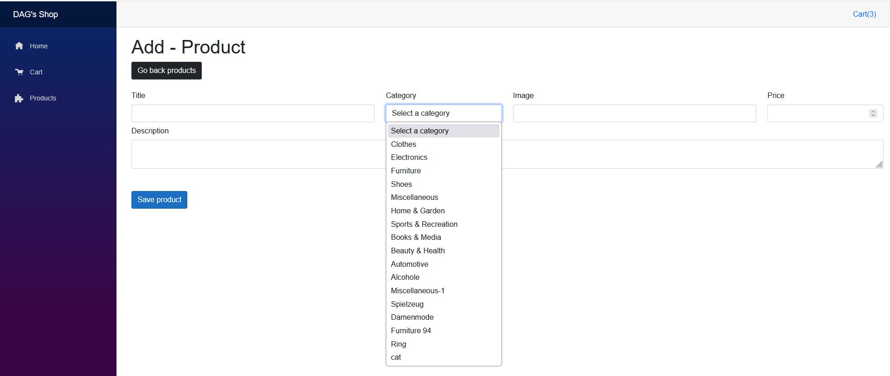

# BlazorStoreApp 🛒

Welcome to **BlazorStoreApp**! This is an online store project built with **Blazor WebAssembly** and .NET 6, designed to showcase best practices in frontend and backend development with C#.

## 🚀 Description
BlazorStoreApp is a modern e-commerce web application where users can:
- Browse products with images, prices, and descriptions.
- Add products to an interactive shopping cart.
- View and manage the cart in real time (add, remove, clear items).
- Add new products (admin functionality).

The interface is responsive, visually appealing, and uses toast notifications for a great user experience.

## ✨ Key Features
- **Frontend in Blazor WebAssembly**: Reactive and fluid UI using components.
- **Global Cart**: Shared state and product counter in the main layout, always up to date.
- **Toast notifications**: Floating, centered messages for instant feedback.
- **Modern styles**: Bootstrap and component-scoped CSS.
- **REST API consumption**: Products and categories are fetched from [Fake Store API](https://api.escuelajs.co/api/v1/).
- **PWA Ready**: Installable as an app on mobile and desktop devices.

## 🖼️ Screenshots

 
  *Main products page*

  
  *Shopping cart in action*

  
  *Admin: Add new product*

## 🛠️ Technologies Used
- [.NET 6](https://dotnet.microsoft.com/en-us/download/dotnet/6.0)
- [Blazor WebAssembly](https://dotnet.microsoft.com/apps/aspnet/web-apps/blazor)
- [Bootstrap 5](https://getbootstrap.com/)
- REST API consumption

## ⚡ How to Run the Project
1. **Clone the repository:**
   ```bash
   git clone https://github.com/your-username/BlazorStoreApp.git
   cd BlazorStoreApp/BlazorStoreApp
   ```
2. **Restore packages and run:**
   ```bash
   dotnet restore
   dotnet run
   ```
3. Open your browser at [https://localhost:7047](https://localhost:7047) or the URL shown in the console.

## 📁 Main Structure
- `Pages/Products/Products.razor` — Main products view
- `Pages/Counter.razor` — Shopping cart
- `Pages/Products/AddProduct.razor` — Add product form
- `Services/CartService.cs` — Global cart logic
- `Shared/MainLayout.razor` — Layout and global counter

## 👨‍💻 About the Author
This project was developed by **David Andrés Garzón Sánchez** as part of my professional portfolio. Feel free to contact me for job opportunities or collaborations!

---

> ⭐ _If you like this project, please star it and check out my profile for more examples of clean and professional code!_ 